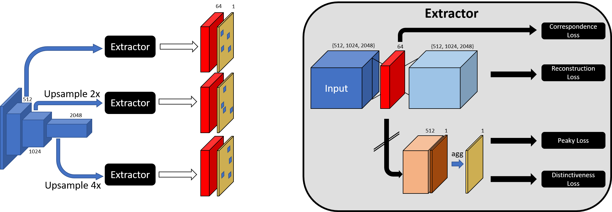
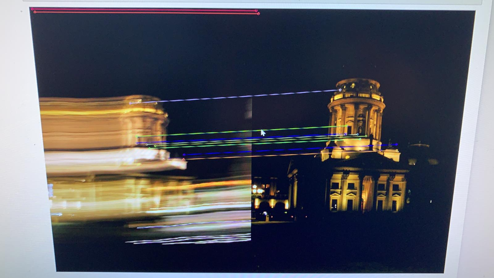

# Using Multi-Level Convolutional Information for Scale- and Viewpoint-Robust Local Features

## Abstract
> Fast and robust key point detection and feature matching is an important task for many problems in computer vision, for example Image Retrieval and Augmented Reality.
Two key issues arise: Key point detectors in real-time applications have to be both fast to compute and robust to change in illumination, viewpoint and scale.
In this work we aim to increase the robustness of feature descriptors against scale and viewpoint changes while maintaining similar performance otherwise.
To this end, we expand on previous work, using a pretrained ResNet backbone and add an attention layer for keypoint selection, which we train directly on the quality of the keypoints.
Critical to our goal, we forward multi-level convolutional activations directly to the final attention layer, bypassing further transformations and thus combining local with global information in the descriptor generation.

  Architecture             | Correspondence examples
:-------------------------:|:-------------------------:
 | 

## Directory layout
Here, an overview over the files is given. The main components are the **dataset**, **architecture**, **losses** and **benchmarking**.
```
.
├── checkpoints
├── externals
├── hpatches_sequences                <--- Benchmarking files
├── lib
│   ├── feature_extractor
│   │   └── feature_extraction.py
│   ├── attention_model.py            <--- Attention and training
│   ├── autoencoder.py                <--- Autoencoder and training
│   ├── correspondence_datamodule.py  <--- Correspondence handler
│   ├── extraction_model.py           <--- Feature extraction
│   ├── loss.py                       <--- Different loss implementations
│   └── megadepth_dataset.py          <--- Dataset handler
├── notebooks
├── extract_features.py               <--- This script uses the trained model
├── load_script_leonhard.sh
├── README.md
├── requirements.txt
└── run_bench.sh
```

### Setup
Create a new conda environment and install the packages from *environment.yml* (Linux):
```bash
conda env create -n DL -f environment.yml
conda activate DL
```
If you are using Leonhard for training, you can run
```
source load_script_leonhard.sh
```
Note that if you want wo train you need to download the MegaDepth dataset and set 
```
export MegaDepthDatasetPath="/path/to/MegaDepthDataset"
```

### Load Model & Evaluate with HPatches

Already evaluated models can be seen in *hpatches_sequences/HPatches-Benchmark-Comparison.ipynb* and in *hpatches_sequences/HPatches-Benchmark-Losses.ipynb*. The results for them are cached in *hpatches_sequences/cache*, so they notebook can be rerun yielding the same results.

##### Download HPatches
First go to *hpatches_sequences* and run
```bash
sh download.sh
```
to download the HPatches dataset.

##### Extract Keypoints

To extract keypoints on the dataset run from the project root folder
```
python extract_features.py --attention_ckpt cfe64_multi_attention_model2_distinctiveness+_lossN2_lambda05_sm_SHARED --load_from_folder
```
This should work without having to download an additional checkpoint.
The results will be saved with the extension **.our-model**. In order to use another extension use `--output_extension .some-extension` or use `--smart_name` in order to generate an extension based on the used model and parameters. The generated extensions are written to *checkpoints/extensions.txt*.

Other useful parameters: 
* `--nogpu` if you don't have a GPU 
* `--load_from_folder` The checkpoint must be in *checkpoints/checkpoint_name.ckpt* as set by --attention_ckpt. By default, checkpoints are automatically downloaded from Polybox. This, however, requires authentication. If you want to use the automatic download, please contact philipp.lindenberger@math.ethz.ch. Alternatively, you can download the checkpoints from https://polybox.ethz.ch/index.php/s/LlnekeNyCa0QJ5I manually, add them with the correct name to the *checkpoints/* folder and use the `--load_from_folder` parameter.

##### Evaluate
Run *HPatches-Benchmark.ipynb* in *hpatches_sequence*. Add the used extensions the *methods* and *names* field in the notebook(*our-model* is already added). 
Set *visualize* and *use_ransac* (described in the paper as refined) to *True* or *False*. To make sure that the evaluation is executed, make sure that the extension you want to evaluate is not already contained in the cache folder (**just delete it**: Using the default extension, delete *hpatches_sequences/cache/our-model.npy*). 

##### Available Attention Checkpoints
Attention checkpoints also contain weights for the encoder. The correct attention layer for each checkpoint is automatically loaded by *extract_features.py* when `python extract_features.py --attention_ckpt CHECKPOINT`. Available checkpoints are:
<details>
<summary> Click to expand </summary>

* cfe64_multi_attention_model2_d2netloss
* cfe64_multi_attention_model2_d2netloss_backprop
* cfe64_multi_attention_model_d2netloss
* cfe64_multi_attention_model_d2netloss_backprop
* cfe64_multi_attention_model_distinctiveness+_loss
* cfe64_multi_attention_model_distinctiveness+_lossN8_l1
* cfe64_multi_attention_model_distinctiveness+_lossN32_l1
* multi_attention_model_distinctiveness_loss
* cfe64_multi_attention_model2_distinctiveness+_lossN16_lambda01_sm_lowmargin_SHARED
* cfe64_multi_attention_model2_distinctiveness+_lossN16_lambda01_lowmargin
* cfe64_multi_attention_model2_distinctiveness+_lossN8_lambda01_sm_SHARED
* cfe64_multi_attention_model2_distinctiveness+_lossN8_lambda01_sm
* cfe64_multi_attention_model2_distinctiveness+_lossN8_lambda1
* cfe64_multi_attention_model2_distinctiveness+_lossN2_lambda05_sm_SHARED
* cfe64_multi_attention_model2_distinctiveness+_lossN2_lambda05_sm
* cfe64_multi_attention_model2_distinctiveness+_lossN64_lambda1
* cfe64_multi_attention_model2_distinctiveness+_lossN32_lambda1
* cfe64_multi_attention_model2_distinctiveness+_lossN16_lambda01_sm
* cfe64_multi_attention_model2_distinctiveness+_loss
</details>

### Training
To train the model yourself, you first need to obtain the `MegaDepth` dataset from [here](http://www.cs.cornell.edu/projects/megadepth/) (~600GB).
Afterwards, you need to preprocess the scenes using the tools provided by the [D2-Net repository](https://github.com/mihaidusmanu/d2-net/tree/master/megadepth_utils).
Then, if the necessary python requirements are installed (see above), you can start the training:
```bash
export MegaDepthDatasetPath="/path/to/MegaDepthDataset"
python -m lib.attention_model
```

### Run tensorboard on leonhard and open locally
First, make sure you have the right version of python loaded (with tensorflow etc).
My script is this one:
```
# Filename: load_script.sh
# Activate using `source ./load_script.sh`
module load gcc/6.3.0
module load python_gpu/3.8.5
# pip install --user tk-tools
module load tk/8.6.6
module load hdf5/1.10.1
```
Then, you can open tensorboard and pass a free port. You can also try to leave out the port and copy the one it gives you.
```
tensorboard --logdir ./tb_logs --port 6660
```
Finally, on your local computer, you can forward the port from the cluster to your local computer:
```
ssh -NL 6001:localhost:6660 eth-id@login.leonhard.ethz.ch
```
Now you can open `http://localhost:6001` in your local browser and check out your tensorflow.

## Similar Work
[DELF & DELG](https://github.com/tensorflow/models/tree/master/research/delf)  
[DELF PyTorch :) ](https://github.com/nashory/DeLF-pytorch)  
[D2-Net](https://github.com/mihaidusmanu/d2-net)  
[Deep Image Retrieval](https://github.com/naver/deep-image-retrieval)  
